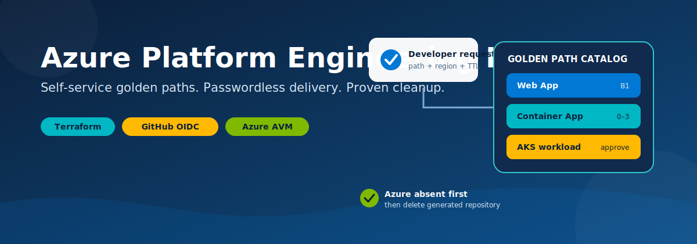
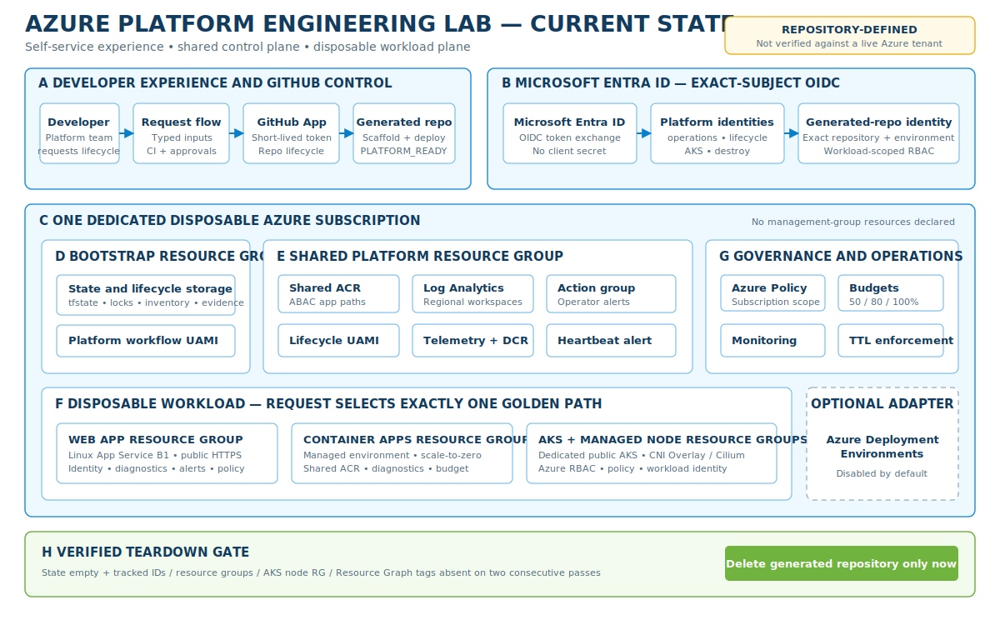
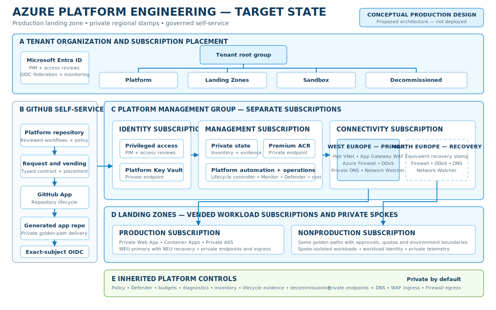
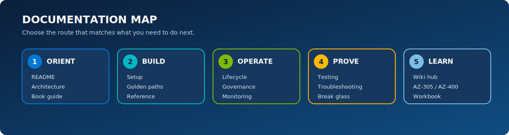

# Azure Platform Engineering Lab

[](https://developer.hashicorp.com/terraform)
[](https://registry.terraform.io/providers/hashicorp/azurerm/4.80.0)
[](https://nodejs.org/)
[](https://learn.microsoft.com/azure/developer/github/connect-from-azure-openid-connect)
[](LICENSE)

<p align="center">
  
</p>

Build a small internal developer platform on Azure. A developer selects a golden path in GitHub Actions, and the platform creates a ready-to-use application repository, provisions Azure with Terraform, deploys a sample application over OpenID Connect (OIDC), observes it, and removes both the cloud environment and repository when its time-to-live (TTL) expires.

```text
request form -> generated repository -> Terraform environment -> HTTPS endpoint
     |                    |                       |                  |
 inventory             OIDC trust              policy            monitor
     `-------------------- reconciler + verified cleanup -----------'
```

This is a hands-on lab and portfolio reference—not a production platform blueprint. It deliberately makes identity, lifecycle, policy, cost, and failure handling visible so that you can learn how a platform behaves after the happy-path deployment.

> [!CAUTION]
> Cleanup permanently deletes generated application repositories immediately after Azure absence is proven. Use a dedicated GitHub organization or account and a disposable Azure subscription. Public forks, clones, caches, and package copies cannot be recalled.

## Why this lab exists

| Platform-engineering question | What the lab demonstrates |
| --- | --- |
| How do developers request infrastructure without editing Terraform? | A typed `workflow_dispatch` form with validated golden-path inputs. |
| How does a generated repository deploy without stored Azure credentials? | Per-repository workload identity federation and GitHub Actions OIDC. |
| How do we make the paved road consistent? | Versioned, self-contained Terraform roots following Azure Verified Modules conventions. |
| How do we control cost in a disposable lab? | Small defaults, budgets and alerts, bounded TTL, and reconciliation every 15 minutes. |
| How do we automate destructive cleanup safely? | Immutable inventory, serialized state transitions, double absence checks, and identity-bound repository deletion. |
| How do we prove it works? | Static checks, contract tests, live create/deploy/smoke/destroy tests, and retained sanitized evidence. |

## Quality review path

If you are reviewing this repository, use this order:

| Step | Start here | What it proves |
| --- | --- | --- |
| 1. Understand the contract | [Architecture](docs/architecture.md) and [lifecycle safety](docs/lifecycle.md) | The trust boundaries, state machine, and deletion invariant are explicit. |
| 2. Inspect a paved road | `golden-paths/web-app-v1/` | A low-cost, self-contained Terraform composition can create a monitored endpoint. |
| 3. Inspect identity | `platform/` and `.github/workflows/request-environment.yml` | Azure access is federated; no client secret is required. |
| 4. Review guardrails | `policies/` and [governance](docs/governance.md) | Regions, tags, budgets, public ingress, and policy exceptions are documented and testable. |
| 5. Review cleanup | `controller/` and `.github/workflows/reconcile-environments.yml` | Repository deletion cannot occur before verified Azure absence. |
| 6. Run local validation | See [testing](docs/testing.md) | Terraform, policy, workflow, application, image, Helm, and secret checks are repeatable. |
| 7. Run a live slice | Request `web-app` with a four-hour TTL | The repository, endpoint, monitoring, evidence, and teardown work end to end. |

## Table of contents

- [Architecture](#architecture)
- [Golden paths](#golden-paths)
- [Request experience](#request-experience)
- [Lifecycle contract](#lifecycle-contract)
- [Quick start](#quick-start)
- [Authentication and authorization](#authentication-and-authorization)
- [CI/CD flow](#cicd-flow)
- [Governance and cost controls](#governance-and-cost-controls)
- [Monitoring and evidence](#monitoring-and-evidence)
- [Validation](#validation)
- [Lab timing](#lab-timing)
- [Optional ADE compatibility track](#optional-ade-compatibility-track)
- [Troubleshooting quick table](#troubleshooting-quick-table)
- [Repository map](#repository-map)
- [Documentation map](#documentation-map)
- [Lab boundaries](#lab-boundaries)
- [Contributing and security](#contributing-and-security)

## Architecture

### Current state — repository-defined lab

<p align="center">
  
</p>

The current state maps directly to this repository. GitHub provides the request and generated-repository lifecycle, Microsoft Entra ID provides exact-subject OIDC without an Azure client secret, and one dedicated disposable subscription contains the bootstrap, shared platform, governance and workload resources. A request selects exactly one Web App, Container Apps or AKS golden path. Shared ACR, Log Analytics, inventory, action groups and state remain platform-owned, while the final gate requires two independent Azure-absence checks before repository deletion.

### Target state — conceptual production design

<p align="center">
  
</p>

The target state shows how the same repository-driven product model could evolve for production. Identity, management and connectivity move into separate platform subscriptions beneath a platform management group; production and nonproduction workloads receive vended landing-zone subscriptions and private spokes; and regional hub stamps provide private DNS, WAF ingress, firewall egress, DDoS protection and recovery placement. This is a proposed architecture, not functionality currently deployed by the lab.

See [Architecture](docs/architecture.md) for identity and data flows, [the wiki architecture guide](wiki/architecture/overview.md) for a current-versus-target walkthrough, [Setup](docs/setup.md) for bootstrap order, and [Monitoring](docs/monitoring.md) for operational signals.

## Golden paths

| Path | Azure composition | Delivery | Lab default | Approval |
| --- | --- | --- | --- | --- |
| **Web App** | Linux App Service plan, Web App, Application Insights, diagnostics, alerts | Test and ZIP deploy | B1 | Automatic |
| **Container App** | Workload-profiles-v2 environment, Container App, managed identity, diagnostics, alerts | Build, push to repository-scoped ACR path, deploy revision | Consumption; 0–3 replicas | Automatic |
| **AKS workload** | Dedicated AKS cluster, Azure RBAC, CNI Overlay/Cilium, Azure Policy, workload identity, Container Insights | Build/push image, Helm deploy, managed HTTPS route | Free tier; one `Standard_B2s`, autoscale 1–2 | Required |

Every sample application exposes:

- `/` — human-readable landing page;
- `/healthz` — liveness;
- `/readyz` — readiness;
- `/metadata` — non-sensitive environment and build metadata.

Read [Golden paths](docs/golden-paths.md) before changing a module contract or publishing a new version.

## Request experience

From **Actions → Request environment → Run workflow**, enter:

| Input | Allowed values | Default or rule |
| --- | --- | --- |
| `golden_path` | `web-app`, `container-app`, `aks` | Required |
| `environment_name` | Lowercase slug, 3–20 characters | Required |
| `repository_name` | Lowercase slug, 3–50 characters | Required |
| `location` | `westeurope`, `northeurope`, `germanywestcentral` | `westeurope`; preflight still checks service/quota availability |
| `ttl_hours` | `4`, `8`, `24`, `48`, `72` | `24` |
| `acknowledge_aks_cost` | Explicit acknowledgement | Required only for AKS |

The requester is always derived from `github.actor`; it is never accepted as user input. A successful run summary includes the immutable environment ID, generated repository URL, HTTPS endpoint, resource groups, expiry, state key, budget, monitoring links, and destroy/extend commands.

The generated workflow remains inert until the platform sets `PLATFORM_READY=true`, after the exact repository/environment OIDC subject and least-privilege Azure role have been created.

## Lifecycle contract

<p align="center">
  
</p>

```text
REQUESTED -> REPO_READY -> AZURE_CREATING -> ACTIVE -> QUIESCING
    -> AZURE_DELETING -> AZURE_ABSENT -> REPO_DELETING -> DELETED
```

The central safety invariant is:

> **The controller must never issue GitHub repository DELETE until the environment is at `AZURE_ABSENT` and two independent verification passes find no tracked Azure resources.**

Deletion is bound to immutable GitHub numeric and GraphQL node IDs. Name-only deletion is forbidden. A transfer, owner mismatch, renamed/reused identity mismatch, Azure residual, or inconclusive lookup fails closed and alerts. See [Lifecycle and destructive safety](docs/lifecycle.md).

## Quick start

### Prerequisites

- A dedicated disposable Azure subscription where you can bootstrap as **Owner**.
- An existing Microsoft Entra developer group object ID.
- A dedicated GitHub organization or account where a GitHub App may administer generated repositories.
- Azure CLI, Git, Terraform `1.15.8`, Conftest `0.68.2`, Node.js 24 LTS, and PowerShell 7 or Bash. Actions installs and checksum-verifies the pinned Conftest binary automatically.
- For AKS: sufficient regional vCPU quota and access to the default-domain application-routing preview used by this lab.

### 1. Clone and validate

```bash
git clone https://github.com/<owner>/azure-platform-engineering-lab.git
cd azure-platform-engineering-lab
terraform fmt -check -recursive
```

### 2. Bootstrap state locally

```bash
az login
az account set --subscription <subscription-id>
cd bootstrap
terraform init
terraform plan -out bootstrap.tfplan \
  -var storage_account_name=<globally-unique-name> \
  -var github_owner=<owner> \
  -var github_repository=azure-platform-engineering-lab \
  -var github_environment=platform-operations
terraform apply bootstrap.tfplan
```

The bootstrap creates Azure Storage with blob versioning, soft delete, Azure AD authorization, state containers, inventory/operation/evidence tables, and the lock container. Move platform state to the emitted backend configuration before continuing; do not commit backend values containing identifiers you intend to keep private.

### 3. Provision the shared platform

Follow [Setup](docs/setup.md) to create the GitHub App, configure its installation/private key, register the platform OIDC subject, publish the template repository, initialize the remote backend, and apply `platform/`.

### 4. Configure GitHub environments

- Run the setup helper to protect `main`, generate validated catch-all CODEOWNERS, and limit all four privileged environments to the exact `main` deployment branch. It requires reviewers for AKS, shared-platform mutations, and destructive operations; `lifecycle` stays reviewer-free so automatic cleanup cannot be stranded.
- Store separate copies of the GitHub App private key only as `lifecycle`, `aks-approval`, and `destructive-operations` environment secrets. Repository- and organization-level copies accessible to this repository are forbidden.
- Store Azure client, tenant, and subscription IDs as non-secret variables where repository policy permits.
- In organization mode, configure `ORGANIZATION_REQUESTERS` as the reviewed comma-separated member allowlist; requesters must also have write-equivalent access to this platform repository.
- Do **not** create an Azure client secret.
- Repository deletion defaults to `ENABLE_REPOSITORY_DELETE=true`, so verified teardown is followed immediately by deletion. For the first canary only, use `-DisableRepositoryDeletion`; re-enable the default after manually reviewing the two Azure-absence checks and immutable identity evidence.

### 5. Request the first environment

Use `web-app`, `westeurope`, and a four-hour TTL. Observe the request summary, generated repository, OIDC deployment, `/healthz`, inventory row, budget, logs, and expiry. Then run an owner-initiated destroy; confirm the `AZURE_ABSENT` evidence appears before repository deletion.

## Authentication and authorization

- GitHub Actions exchanges an OIDC token for Azure access. No static Azure credential is stored.
- The subject is exact: `repo:<owner>/<repository>:environment:deployment`, and that generated-repository environment accepts deployments from the exact `main` branch only.
- Each generated repository identity is scoped to its own workload resources.
- Container image writers and readers are constrained to `apps/<repository-id>` through ACR RBAC-plus-ABAC mode.
- The setup and token provider fail closed unless the GitHub App has exactly Administration, Contents, Actions, Variables, and Metadata repository permissions; organization mode additionally requires only `Members: read` to prove current membership.
- The GitHub App private key is the platform's only intended long-lived automation secret. Its copies are scoped to the three environments whose workflows need it; the setup helper rejects repository secrets and accessible organization secrets with that name. Rotate it and restrict access as described in [Security](SECURITY.md).
- Protected `main` requires a fresh code-owner approval of the last push, dismisses stale reviews, applies to administrators, has no review-bypass actors, and forbids force push/deletion. All ten CI jobs are required on an up-to-date branch; organization pushes are limited to validated platform admins.

## CI/CD flow

| Workflow | Trigger and responsibility | Safety boundary |
| --- | --- | --- |
| `.github/workflows/ci.yml` | Pull request/push validation of controller, scaffold, Terraform and workflow policy | Read-only; no Azure or GitHub App credential exchange |
| `.github/workflows/platform.yml` | Manual shared-platform plan/apply/destroy | `platform-operations` protection; every delete/replace plan closes admissions and requires zero GitHub/ADE environments |
| `.github/workflows/request-environment.yml` | Typed self-service request and transactional provisioning | `lifecycle` for automatic paths; `aks-approval` for AKS |
| `.github/workflows/extend-environment.yml` | Owner/admin bounded TTL extension | Lease, ETag, fence, 72-hour cap and 15-minute cutoff |
| `.github/workflows/destroy-environment.yml` | Confirmed owner-initiated teardown | `destructive-operations`; immutable environment ID confirmation |
| `.github/workflows/reconcile-environments.yml` | 15-minute expiry/drift/retry controller | Phase-aware idempotency and fail-closed repository deletion |
| Generated repository deployment | Push/initial dispatch, test and path-specific deploy | Exact `deployment` OIDC subject and `PLATFORM_READY` gate |

Shared-platform and lifecycle workflows use separate managed identities. Workflow permissions request `id-token: write` only where Azure exchange is needed; pull-request source validation stays credential-free.

## Governance and cost controls

Required environment tags include the immutable environment ID, human-readable environment, owner, golden path/version, expiry, management channel, expected public-HTTPS posture, and Terraform ownership. Immutable creation time remains in central inventory. Azure Policy audits/enforces the lab's region, tags, and expected public HTTPS posture; Terraform configures diagnostics to the same-region shared workspace selected from the platform's EU workspace map.

| Golden path | Default monthly budget amount* | Primary cost control |
| --- | ---: | --- |
| Web App | 10 | B1 plan plus bounded TTL |
| Container App | 15 | Consumption scale-to-zero plus bounded TTL |
| AKS | 75 | Small free-tier control plane profile plus bounded TTL |

\* Amounts are expressed in the subscription billing currency and are examples, not price estimates. Budgets notify at 50%, 80%, and 100% actual and 100% forecast; they do not stop resources. TTL cleanup is the enforcement mechanism. Azure prices, free grants, taxes, and regional availability change—review the [Azure Pricing Calculator](https://azure.microsoft.com/pricing/calculator/) before deployment. Cost notes last reviewed **2026-07-11**.

See [Governance](docs/governance.md) and [Cost model](docs/costs.md).

## Monitoring and evidence

The primary shared workspace receives platform lifecycle events, while each workload uses the shared workspace in its own allowed region (required for AKS Container Insights). The action group reports failed cleanup, repository identity mismatches, repeated transient failures, and a missing reconciler heartbeat. Useful operational views include:

- active and expiring environments by golden path;
- lifecycle duration and failure stage;
- resources whose expiry tag has passed;
- cleanup retries and Azure residuals;
- health and availability by endpoint;
- budget alerts and forecast notifications.

Sanitized lifecycle evidence and tombstones are retained for 90 days. Restricted state backups are retained for seven days. No source-code archive is retained by the controller.

## Validation

Pull requests are expected to run the relevant subset of:

```text
Terraform fmt/init/validate/test     TFLint, Checkov, Trivy, Conftest
Gitleaks, actionlint, ShellCheck     Hadolint, terraform-docs
Markdown and link checks             npm test and Docker build
Helm lint and kubeconform            optional Infracost
```

Live validation creates each path, proves generated-repository OIDC delivery and HTTPS health, then destroys it and verifies state, resource groups, AKS node resource group, ACR artifacts, and repository absence. Read [Testing](docs/testing.md) before running live tests because they create billable resources and permanently delete generated repositories.

## Lab timing

Times vary with provider registration, regional capacity, OIDC/RBAC propagation, image pulls and Azure deletion consistency. Use these planning ranges, not service-level objectives:

| Activity | Typical planning range |
| --- | ---: |
| Read setup and run local preflight | 15–30 minutes |
| One-time bootstrap, GitHub App and shared platform | 30–60 minutes |
| Web App request to healthy endpoint | 10–20 minutes |
| Container App request to healthy revision | 15–30 minutes |
| AKS request, approval and healthy workload | 25–50 minutes |
| Normal verified teardown | 10–30 minutes; AKS can take longer |
| Full three-path learning session with evidence | 3–5 hours |

Do not stop watching a delete merely because it exceeds a range. Inspect the recorded phase and residual checks; correctness takes priority over speed.

## Optional ADE compatibility track

Azure Deployment Environments (ADE) support is disabled by default. Microsoft documents ADE as being in maintenance mode with no additional features planned; existing capabilities remain available. For that reason, this repository treats ADE as a **compatibility exercise**, not the recommended primary experience.

The ADE adapter reuses versioned golden-path Terraform, uses managed identity, supports only deploy/delete, and relies on ADE-owned state at `$ADE_STORAGE/environment.tfstate`. It cannot adopt GitHub-created environments, and GitHub cannot adopt ADE-created environments. See [ADE compatibility](docs/ade-compatibility.md) and Microsoft's [maintenance-mode guidance](https://learn.microsoft.com/azure/deployment-environments/maintenance-mode).

## Troubleshooting quick table

| Symptom | First check |
| --- | --- |
| Azure login reports no matching federated identity | Compare repository owner/name, `deployment` environment, issuer, audience, and exact OIDC subject. |
| Request remains at `REPO_READY` | Check `PLATFORM_READY`, GitHub App installation access, variables, and first workflow dispatch. |
| Region preflight fails | Confirm provider registration, SKU availability, vCPU quota, and AKS default-domain capability. Do not bypass the preflight. |
| Cleanup stops at `AZURE_DELETING` | Inspect tracked inventory and Resource Graph results. Do not manually advance the phase. |
| Cleanup stops at `AZURE_ABSENT` | Azure is gone; inspect immutable GitHub repository identity/owner checks and App permission. |
| Budget alert did not stop spend | Expected: budgets notify but do not stop consumption. Destroy or shorten TTL. |

See [Troubleshooting](docs/troubleshooting.md) for recovery boundaries and the approved [break-glass runbook](docs/runbooks/break-glass.md) for irrecoverable state.

## Repository map

```text
.
|-- .github/workflows/          # request, reconcile, CI and live validation
|-- runner/ade-terraform/       # optional maintenance-mode ADE Terraform runner
|-- bootstrap/                  # one-time backend and inventory foundation
|-- controller/                 # lifecycle state machine and cloud/GitHub adapters
|-- docs/                       # operator-oriented guides and diagrams
|-- golden-paths/               # web-app-v1, container-app-v1, aks-workload-v1
|-- platform/                   # shared registry, logs, identity, policy and budgets
|-- policies/                   # policy-as-code checks
|-- scaffolds/application/      # canonical Node.js generated-repository template
|-- tests/                      # contract, integration and failure tests
`-- wiki/                       # book-style learning and certification exercises
```

## Documentation map

<p align="center">
  
</p>

| Goal | Guide |
| --- | --- |
| Install the lab | [Setup](docs/setup.md) |
| Understand trust boundaries and flow | [Architecture](docs/architecture.md) |
| Compare or extend paved roads | [Golden paths](docs/golden-paths.md) |
| Operate expiry and cleanup | [Lifecycle](docs/lifecycle.md) |
| Review policy, identity, budgets and evidence | [Governance](docs/governance.md) |
| Query signals and respond to alerts | [Monitoring](docs/monitoring.md) |
| Validate locally and live | [Testing](docs/testing.md) |
| Diagnose failures | [Troubleshooting](docs/troubleshooting.md) |
| Learn end to end | [Wiki hub](wiki/README.md) or [book-style guide](wiki/book.md) |
| Practice AZ-305/AZ-400 objectives | [Certification workbook](wiki/certifications/lab-workbook.md) |

## Lab boundaries

Version 1 intentionally excludes a custom portal/Backstage integration, production private networking, databases, multiple languages, multi-subscription vending, large or shared AKS clusters, hard budget enforcement, and production support claims. Public endpoints and repositories are intentional learning choices, not general recommendations.

## Contributing and security

Read [CONTRIBUTING.md](CONTRIBUTING.md) before proposing a change. Report vulnerabilities privately according to [SECURITY.md](SECURITY.md); do not open a public issue for secrets, privilege escalation, repository-deletion bypasses, or identity-boundary defects. Participation is governed by [CODE_OF_CONDUCT.md](CODE_OF_CONDUCT.md).

## License

Released under the [MIT License](LICENSE).