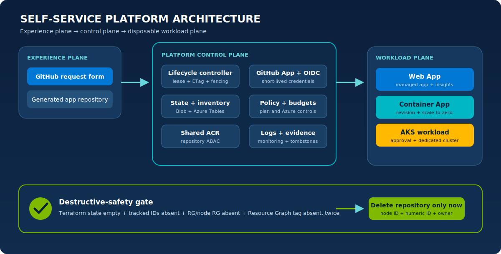

# Architecture

The lab separates the developer experience, platform control plane, and disposable workload plane. This boundary keeps shared resources out of workload destroy plans and makes lifecycle authority auditable.

<p align="center">
  
</p>

## Components

| Plane | Component | Responsibility |
| --- | --- | --- |
| Experience | Request/extend/destroy workflows | Validate actor and typed inputs; display the environment contract |
| Experience | Generated application repository | Own application source and deploy through its own OIDC identity |
| Control | Bootstrap | Create protected state, locks, inventory, operations, and evidence storage |
| Control | Shared platform | ACR, Log Analytics, action group, policy definitions, controller identity |
| Control | GitHub App | Create/configure/archive/delete generated repositories using an installation token |
| Control | Lifecycle controller | Reconcile desired/actual state, enforce TTL, serialize mutations, verify teardown |
| Workload | Golden-path Terraform root | Create exactly one environment and output its endpoint/resource inventory |
| Workload | Runtime identity | Pull its own image and access only explicitly granted resources |
| Optional | ADE adapter | Exercise the same path definitions through a maintenance-mode channel |

## Request sequence

```text
Developer        GitHub workflow       Controller        GitHub App        Azure
    | request          |                    |                 |               |
    |----------------->| validate actor     |                 |               |
    |                  |-- UUIDv7/inventory>|                 |               |
    |                  |                    |-- generate ---->| template repo |
    |                  |                    |<-- IDs ----------|               |
    |                  |                    |-- plan/apply ------------------->|
    |                  |                    |<-- outputs/resources ------------|
    |                  |                    |-- create exact OIDC trust ------>|
    |                  |                    |-- variables/dispatch ----------->|
    |                  |                    |<------- deployment + smoke ------|
    |<-----------------| summary: repo, endpoint, expiry, monitoring           |
```

The inventory write precedes repository or Azure creation. Provisioning is transactional from the controller's perspective: a failure enters the same cleanup state machine rather than using an untracked ad hoc rollback.

## Identity flow

There are three separate identities:

1. **Platform workflow identity** — trusted only from the main repository's protected `platform-operations` environment; can manage shared platform/control-plane scope.
2. **Lifecycle identity** — uses exact `lifecycle`, `aks-approval`, and `destructive-operations` subjects for the matching jobs and operates inventory, locks, workload lifecycle and evidence within its documented scope.
3. **Generated repository identity** — trusted from the exact generated repository and `deployment` environment; can deploy only its environment.

Azure login uses the issuer `https://token.actions.githubusercontent.com`, audience `api://AzureADTokenExchange`, and an exact subject. IDs may be GitHub variables; private keys/tokens remain secrets. An Azure client secret is neither required nor expected.

GitHub uses a separate trust mechanism: the controller creates short-lived installation tokens from the GitHub App private key and refreshes them before GitHub phases in long AKS, destroy, and serial reconciliation runs. Before every mint it proves the installation has exactly the reviewed Administration, Contents, Actions, Variables, Metadata, and conditional Members permissions, rejects additions or missing access, and verifies the token response again. The key is removed from the process environment before child tools start and retained only in the isolated lifecycle PowerShell process. The App's private key is the only intended long-lived automation secret.

## State and inventory

Terraform state answers, “what did this Terraform root create?” Inventory answers, “what environment does the platform believe exists, who owns it, and what must be cleaned?” Neither replaces the other.

| Store | Key/partition | Content |
| --- | --- | --- |
| Blob state | `workloads/github/<path>/<uuid>.tfstate` | Terraform-managed resources and outputs |
| `PlatformEnvironments` | immutable environment ID | Desired state, phase, owner, expiry, path/version, repository IDs, resource groups, attempts, evidence hash |
| `PlatformResources` | environment ID + canonical resource/residual ID | Every disposable Azure resource and node RG, plus the exact shared-ACR repository as `<acr-id>/repositories/apps/<repository-id>` |
| `PlatformOperations` | environment ID + ordered operation | Append-only checkpoints, attempts, sanitized errors, fencing generation |
| Evidence/tombstones | environment ID | Sanitized proof retained after state/repository removal |

A blob lease serializes external work; Azure Table ETags protect optimistic updates; a fencing generation prevents a delayed worker from committing after its lease has been superseded; GitHub concurrency reduces duplicate workflow execution.

## Shared versus disposable ownership

```text
Platform owns                              Environment references/owns
--------------------------------------     ---------------------------------
state and table storage                    its workload resource group(s)
shared ACR                                 its apps/<repository-id> images
regional Log Analytics workspaces          its same-region diagnostic settings
action group                               its alerts/budget/policy assignment
policy definitions                         its deployment identity/OIDC trust
lifecycle identity                         its application resources
```

The environment can create scoped role assignments to shared services but cannot destroy the service. Cleanup explicitly removes its ACR repository content after Terraform destroy.

## Golden-path composition

Each versioned root (`web-app-v1`, `container-app-v1`, `aks-workload-v1`) accepts a common envelope:

- immutable environment ID and management channel;
- environment/repository owner metadata;
- region, expiry, and tags (creation time remains in central inventory);
- location-keyed shared Log Analytics, ACR, and action-group identifiers;
- `create_resource_group` adapter switch;
- deployment/runtime identity inputs;
- budget amount and administrator contact.

Each emits endpoint, resource group(s), tracked resource IDs, monitoring links, and deployment-specific values. Breaking contract changes create v2; a live v1 definition is not changed incompatibly.

## Network and public exposure

The lab intentionally exposes trusted public HTTPS endpoints so reviewers can validate without private connectivity:

- App Service and Container Apps use native managed HTTPS hostnames.
- AKS uses managed application routing/default-domain capability. If unavailable, preflight fails; no HTTP/self-signed fallback exists.
- Policy audits expected public access rather than enforcing an unrealistic blanket denial for this lab.

Production platforms commonly require private endpoints, custom DNS/certificates, egress control, WAF, network segmentation, and centralized ingress. Those are out of scope for v1.

## Failure model

External operations may be duplicated, delayed, or partially successful. The controller therefore:

- records an intended/checkpointed phase;
- uses immutable IDs and idempotency keys;
- re-reads actual GitHub/Azure state;
- retries transient 429/5xx/propagation failures with bounded backoff;
- fails closed on ownership or identity uncertainty;
- never advances repository deletion when Azure verification is incomplete.

See [Lifecycle](lifecycle.md) for every transition and [Troubleshooting](troubleshooting.md) for operator boundaries.

## Optional ADE boundary

ADE runs the same Terraform roots through a separate adapter and managed identity, with `create_resource_group=false` because ADE supplies the resource group. It stores environment state under `$ADE_STORAGE/environment.tfstate`. GitHub and ADE channels never adopt or mutate one another's environments. See [ADE compatibility](ade-compatibility.md).

## Lab versus production

| Lab choice | Production question to answer |
| --- | --- |
| One disposable subscription | How are management groups, subscriptions and platform/workload teams separated? |
| Public repositories/endpoints | What confidentiality, network, data-loss and supply-chain controls are required? |
| Shared ACR/workspace | What tenant, region, throughput, retention and blast-radius boundaries apply? |
| Dedicated small AKS per request | Would namespaces, virtual clusters, shared clusters, or another compute model be safer/economic? |
| GitHub Actions as the portal | What catalog, API, portal and support experience should the organization own? |
| TTL cleanup | What retention, legal hold, backup, change, and disaster-recovery rules apply? |
