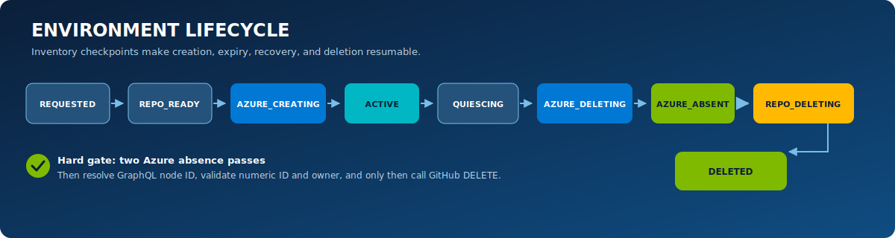

# Lifecycle and destructive safety

Lifecycle automation is the core of this lab. Terraform destroy alone is insufficient because an environment also owns a GitHub repository identity, OIDC trust, ACR image path, budget/policy objects, inventory, and—for AKS—a generated node resource group.

> [!CAUTION]
> Cleanup permanently deletes the generated repository. Never point this controller at an existing or important repository. Never manually change an environment phase to bypass verification.

## State machine

<p align="center">
  
</p>

| Phase | Entry condition | Permitted side effects | Exit evidence |
| --- | --- | --- | --- |
| `REQUESTED` | Valid authorized request; inventory row written | Generate UUID/state key; reserve request/repository names | Authoritative row and operation checkpoint |
| `REPO_READY` | Repository generated and immutable IDs recorded | Render overlay; keep workflows inert | Numeric ID, node ID, owner, commit and manifest hash |
| `AZURE_CREATING` | Saved plan approved by policy | Apply path; inventory resources before/while created | Terraform outputs, resource IDs, OIDC trust |
| `ACTIVE` | Deployment and smoke test pass | Reconcile health/expiry; accept bounded extension/destroy | Endpoint and activation evidence |
| `QUIESCING` | Expired, owner destroy, failed provisioning, or missing repo | Disable Actions; cancel runs; archive repository; prevent new deploys | Quiesce checkpoint |
| `AZURE_DELETING` | Workload is quiesced | Revoke OIDC/RBAC; Terraform destroy; delete ACR path | Empty state and tracked-resource checks |
| `AZURE_ABSENT` | Two successful absence verification passes | Resolve/revalidate immutable repository identity only | Evidence hash and identity match |
| `REPO_DELETING` | `AZURE_ABSENT` and repository IDs/owner match | Issue GitHub DELETE and verify absence | GitHub absence result |
| `DELETED` | Azure and repository absent | Publish and checkpoint the deterministic sanitized tombstone; retain evidence | Tombstone blob name/hash plus final operation record |

Any provisioning failure enters `QUIESCING`; it does not run a separate untracked rollback.

## Non-negotiable deletion invariant

The GitHub DELETE API can be called only when all conditions hold:

1. central inventory phase is `AZURE_ABSENT`;
2. Terraform state has no managed resources;
3. every ID in `PlatformResources` is absent;
4. every tracked resource group, including AKS node RG, is absent;
5. Azure Resource Graph finds no resource with the immutable environment tag;
6. checks 2–5 succeed twice, separated by a reconciliation boundary/delay;
7. current repository is resolved from the stored GraphQL node ID;
8. current numeric repository ID equals the stored numeric ID;
9. current owner equals the configured allowed owner;
10. the worker still holds the current lease/fencing generation.

A repository name is never sufficient. A transfer, mismatched/reused identity, inconclusive Azure query, expired lease, or missing inventory blocks deletion and alerts.

## Serialization and fencing

Four layers make duplicate schedule/manual runs safe:

- GitHub Actions concurrency groups by environment ID;
- an Azure Blob lease serializes the external operation;
- Azure Table ETags prevent lost updates;
- a monotonically increasing fencing generation rejects a delayed previous worker.

The controller rechecks the generation immediately before irreversible external calls. Losing the lease is an operation failure, not a reason to continue optimistically.

## Provisioning transaction

```text
validate actor/input
  -> allocate UUIDv7 and write REQUESTED
  -> generate repository and record immutable identity
  -> save plan and evaluate policy
  -> apply Terraform while preserving predicted RGs and validating every output ID against the configured subscription
  -> configure exact repository OIDC and non-secret variables
  -> set PLATFORM_READY and dispatch initial deployment
  -> wait, smoke test, record ACTIVE
```

Name collision and duplicate-request checks occur before repository generation. If creation or identity persistence is ambiguous, the UUID remains in `REQUESTED`; after a bounded 15-minute observation window the reconciler validates the exact owner, description claim, creation time and template provenance, attaches the returned numeric/node identity, and enters normal teardown. There is no direct “orphan compensation” repository DELETE outside the Azure-absence-gated state machine.

## Reconciliation

The scheduled controller runs every 15 minutes and handles:

- environments whose expiry has passed;
- stale requests or creating phases;
- early repository deletion;
- incomplete cleanup/repository deletion retries;
- desired-state changes from owner destroy/extension;
- reconciler heartbeat and deduplicated incident issue;
- constrained adoption only when immutable IDs match.

Unchanged state is normal. Transient Azure/GitHub 429, 5xx, and propagation errors use bounded exponential backoff and increment the attempt counter.

## Extension rules

The environment owner or platform administrator may request `+4`, `+8`, or `+24` hours. The controller:

- calculates expiry from immutable creation time and caps it at 72 hours total;
- rejects extension within 15 minutes of current expiry;
- rejects extension at or after `QUIESCING`;
- serializes extension against delete and uses the same ETag/lease/fencing controls;
- updates inventory/tags and appends evidence.

An extension does not guarantee budget or quota; it changes only desired expiry within the cap.

## Cleanup order

1. Acquire the environment lease and current generation.
2. Set desired state to delete and phase to `QUIESCING`.
3. Disable Actions, cancel deployments, and temporarily archive the generated repository.
4. Revoke its federated credential and scoped Azure role assignments.
5. Run Terraform destroy using the recorded path version and state key.
6. Delete the exact ACR image repository `apps/<repository-id>`.
7. Verify state, inventory IDs, RGs/node RG, and Resource Graph tag query twice.
8. Record evidence hash and advance to `AZURE_ABSENT`.
9. Resolve repository through node ID; validate numeric ID and owner.
10. Issue GitHub DELETE, verify absence, and advance to `DELETED`.
11. Write the stable sanitized payload to `<environment-id>/tombstone/final.json`, record its SHA-256/blob name under the lease/ETag/fence, and retry this checkpoint idempotently until it succeeds.
12. Retain sanitized evidence/tombstone for 90 days and restricted state backup for seven days. Only a terminal record with the completed tombstone checkpoint is eligible for purge. The reconciler then purges the resource and operation rows under the environment lease and deletes the authoritative environment row last with its ETag.

Automatic direct resource-group deletion is intentionally prohibited. If Terraform/state cannot perform a proven cleanup, use the approved [break-glass runbook](runbooks/break-glass.md).

## Failure behavior

| Failure | Safe response |
| --- | --- |
| Terraform partial apply | Inventory/read back, enter normal cleanup, retry destroy |
| Generated repository deleted early | Record two successful immutable node-ID null observations under lease/fence, continue proven Azure teardown, then complete without issuing GitHub DELETE |
| Azure residual after destroy | Stay `AZURE_DELETING`; never delete repository; alert |
| ACTIVE repository renamed | Treat the exact OIDC subject/name as trust drift; quiesce and revoke the workload identity immediately |
| Repository renamed during/after cleanup | Resolve by node ID, validate numeric ID/owner, and delete its current name only after Azure absence |
| Repository transferred | Azure cleanup may proceed; repository deletion fails closed and alerts |
| GitHub DELETE gets 403/429/5xx after Azure absence | Stay/retry `REPO_DELETING`; do not rerun Azure destroy unnecessarily |
| Final tombstone upload/checkpoint fails | Keep `DELETED` inventory, retry idempotently, and prohibit retention purge |
| Worker crashes | Next reconciler resumes idempotently from checkpoint |
| Scheduler heartbeat missing | Alert/action-group event and one deduplicated central issue |

## Evidence model

Evidence is an allowlisted, sanitized record—not a debug-log archive. It should contain environment ID, operation/phase, actor, timestamps, path/version, state/resource counts, hashes, check outcomes, GitHub numeric/node identity hash, endpoint result, attempts, and final disposition. It must not contain tokens, private keys, source archives, Terraform state, kubeconfig, raw OIDC claims, or application data.

Public forks, clones, caches, and package copies cannot be deleted by this platform. This limitation must be shown to requesters before repository creation.

## Platform destroy guard

The guard applies to explicit platform destroy and to any ordinary platform apply whose saved plan contains a delete or replacement. It acquires the global `platform-admission` Blob lease, so a GitHub request cannot pass its inventory-first `REQUESTED` checkpoint during the guarded window. When ADE is enabled, the guard first disables the project environment type, then requires both `PlatformEnvironments` and the ADE environment count to be empty. It repeats those checks after a short stability interval immediately before applying the saved plan. A plan that would create/replace an enabled ADE environment type while also deleting shared resources is rejected and must be split. Unreadable inventory, a lost lease, an unexpected ADE status/count, or any non-`DELETED` environment fails closed.

An apply that started deleting or replacing ADE control-plane resources leaves ADE admissions closed if it fails; re-enable only through a reviewed recovery apply. Disabling schedules, deleting state storage, or removing the GitHub App before workload cleanup can strand resources and repositories. Break glass requires explicit approval and a preserved evidence record.
