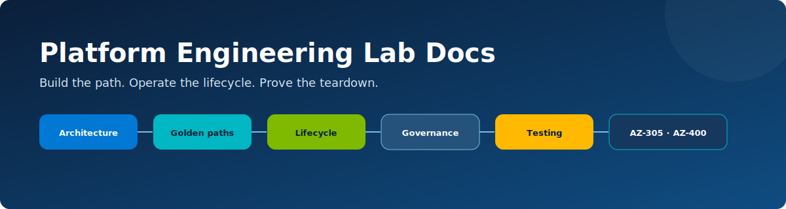

# Azure Platform Engineering Lab documentation

  

This wiki is the learning companion to the repository. The `docs/` folder is organized for operators who need a direct procedure; the wiki explains why the platform is shaped this way and gives you scenarios, questions, and evidence tasks.

## What this lab is—and is not

- It is a runnable, Terraform-first internal developer platform lab.
- It demonstrates self-service, GitHub OIDC, versioned golden paths, policy, cost awareness, observability, reconciliation, and safe teardown.
- It is designed for public sample code/endpoints in one disposable subscription.
- It is not a production platform, confidential workload host, hard budget enforcement system, or enterprise support model.

> [!CAUTION]
> Generated repositories are public and are permanently deleted after Azure absence is proven. Public forks, clones and caches cannot be recalled. Never use important source code or a shared production subscription/account.

## How to use these docs

| If you want to… | Start here |
| --- | --- |
| Read the complete story | [Book-style guide](book.md) |
| Understand planes, ownership and trust | [Architecture overview](architecture/overview.md) |
| Compare the paved roads | [Golden paths](golden-paths/README.md) |
| Understand expiry and deletion safety | [Lifecycle](lifecycle/README.md) |
| Study policy, identity and budgets | [Governance](governance/README.md) |
| Query health and failure signals | [Monitoring](monitoring/README.md) |
| Look up defaults and terms | [Reference](reference/README.md) |
| Run an evidence-based lab | [Testing guide](testing/lab-testing-guide.md) |
| Map the lab to certification objectives | [Certification hub](certifications/README.md) |
| Track a complete learning journey | [Certification workbook](certifications/lab-workbook.md) |

## Learning route

1. Read the architecture and locate each plane in the repository.
2. Deploy Web App with a four-hour TTL and inspect its generated repository/OIDC trust.
3. Compare Container App image identity with Web App artifact delivery.
4. Review AKS approval, quota, HTTPS preview dependency, workload identity and node-RG lifecycle before deploying it.
5. Trace one environment through central inventory and the full state machine.
6. Trigger owner destroy and prove Azure absence occurred before GitHub repository deletion.
7. Use a failure scenario to observe retry/fail-closed behavior.
8. Complete the AZ-305 and AZ-400 evidence tasks.

## Platform in one minute

A workflow accepts a golden path, two safe slugs, an allowed region and a bounded TTL. The controller writes an immutable UUIDv7 inventory record, generates a repository from the canonical scaffold, records its numeric/node IDs, evaluates and applies a versioned Terraform path, and creates an exact `repo:<owner>/<repo>:environment:deployment` Azure federated credential. Only then does it activate the generated workflow.

Every 15 minutes, reconciliation compares desired state, expiry, GitHub and Azure reality. Cleanup quiesces the repository, revokes its identity, destroys Azure, removes non-Terraform residuals, and verifies state/resource/RG/tag absence twice. Only an `AZURE_ABSENT` checkpoint and immutable GitHub identity match allow repository deletion.

## Three golden paths

| Web App | Container App | AKS workload |
| --- | --- | --- |
| Fastest first slice | Container delivery and scale-to-zero | Kubernetes, approval and workload identity |
| B1 App Service | Consumption, 0–3 replicas | Free tier, one B2s, 1–2 nodes |
| ZIP deploy over OIDC | Repository-scoped ACR image | ACR image + Helm + managed HTTPS |
| Automatic | Automatic | Required reviewer + cost acknowledgement |

## Documentation conventions

- **Lab warning** marks a deliberate simplification or destructive/cost boundary.
- **Evidence** means a screenshot, query result, plan/test output or sanitized lifecycle checkpoint you can retain in your workbook.
- **Think like a platform team** asks you to turn an implementation detail into a product/operating decision.
- Volatile version, service status, preview and cost notes include a review date.

## Required foundations

You should be comfortable with basic Git/GitHub, Terraform plan/apply/destroy, Azure resource groups/RBAC/managed identity, and HTTP health checks. Kubernetes expertise is not required for the first two paths.

For installation, follow the operator [setup guide](../docs/setup.md). For a compact default/version lookup, use the [operator reference](../docs/reference.md).

## Optional ADE track

Azure Deployment Environments is not part of the default route. Microsoft documents ADE as being in maintenance mode with no additional features planned. Treat the integration as an optional portability exercise and review [ADE compatibility](../docs/ade-compatibility.md) before enabling it. Status note last reviewed **2026-07-11**.
