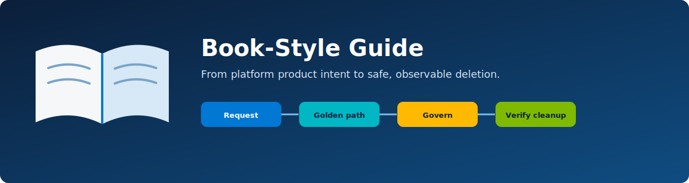

# Azure Platform Engineering Lab — book-style guide

<p align="center">
  
</p>

This guide connects the repository into one narrative: product thinking, request flow, Terraform composition, workload identity, application delivery, governance, operations, failure recovery, and verified deletion.

## How to read this guide

- Parts 1–3 explain the platform product, architecture, and request transaction.
- Parts 4–6 compare the three golden paths and generated application contract.
- Parts 7–9 cover identity, governance, monitoring, and cost.
- Parts 10–12 trace reconciliation, destructive safety, testing, and failure recovery.
- Parts 13–14 cover the optional ADE adapter and certification practice.

If you have one hour, read Parts 1, 3, 7, and 10. If you have a day, request/destroy Web App while capturing the evidence in Part 12.

---

## Part 1 — Treat the platform as a product

The user does not ask for an App Service plan, Log Analytics diagnostic category, federated identity credential or budget notification. They ask for “a Web App for four hours.” The platform turns that intent into a supported contract.

A golden path is useful when it bundles:

- a small, validated request surface;
- infrastructure and application delivery;
- an identity/authorization boundary;
- policy, monitoring, cost and lifecycle defaults;
- a supportable version and evidence trail.

The paved road should be easier than bypassing it, but it must still show its constraints: public lab repository/endpoint, region allowlist, bounded TTL, approval for AKS, and permanent cleanup.

**Think like a platform team:** Which metrics would demonstrate adoption and usefulness without measuring developers as individuals? Candidate metrics include request success, time to healthy endpoint, repeat use, path/version adoption, failed preflights, cleanup reliability and support load.

## Part 2 — Orient to the repository

```text
bootstrap/       state, locks and authoritative inventory foundation
platform/        shared ACR, logs, action group, identity and policy
golden-paths/    versioned Web App, Container App and AKS compositions
scaffolds/application/  canonical generated Node.js repository
controller/      lifecycle model, adapters, reconciliation and evidence
runner/ade-terraform/  optional maintenance-mode compatibility runner
policies/        plan and platform guardrails
tests/           unit, contract, integration and live validation
docs/            concise operator procedures
wiki/            this learning narrative and workbook
```

Shared resources have a longer lifecycle than environments. That is why `platform/` is separate from `golden-paths/`: an environment can reference shared ACR/Log Analytics/action group IDs but its Terraform state cannot own them.

## Part 3 — Follow one request

1. GitHub validates the path/name/location/TTL, derives requester from `github.actor`, and enforces AKS acknowledgement/approval where needed.
2. The controller generates a UUIDv7 and writes `REQUESTED` before external side effects.
3. The GitHub App generates a public repository from the companion template; numeric ID and GraphQL node ID become immutable deletion evidence.
4. The selected overlay and `.platform/environment.json` are rendered, but `PLATFORM_READY` keeps deployment inert.
5. Terraform initializes the environment-specific Blob state, creates a policy-approved saved plan and applies it.
6. Resource IDs and non-Terraform residuals are recorded as the platform learns them.
7. The controller creates the exact generated-repository OIDC subject and least-privilege roles.
8. It sets non-secret variables, activates/dispatches deployment, waits and smoke-tests HTTPS.
9. `ACTIVE` is recorded and the run summary returns endpoint, repository, expiry, monitoring, state, budget, and lifecycle commands.

This ordering answers an important failure question: after any partial success, the next reconciler knows what to inspect and clean.

## Part 4 — Web App: managed runtime path

Web App is the recommended first review because it proves the full control plane with the smallest workload complexity. The path creates a B1 Linux plan, Web App, workspace-based Application Insights, diagnostics, alerts, budget, policies and identity. The generated workflow tests Node.js and ZIP deploys over OIDC.

Look for:

- `https_only` and native trusted endpoint;
- a path-scoped deployment role instead of subscription Contributor;
- `/healthz`, `/readyz` and telemetry;
- tags/expiry on the environment;
- clean separation between shared workspace and disposable diagnostic setting.

## Part 5 — Container App: container contract without cluster ownership

Container App adds image build, registry authorization, revision readiness and scale-to-zero. The shared ACR uses RBAC-plus-ABAC mode: the build identity writes only `apps/<repository-id>`, and runtime reads only that path.

This is an instructive least-privilege exercise. A registry-wide role is convenient but breaks isolation between generated repositories. A live authorization test should prove another repository's path is denied.

Cleanup must remove the ACR repository path separately because the registry is shared and cannot be destroyed with the environment.

## Part 6 — AKS: approval and operational responsibility

AKS demonstrates that a golden path can ask for additional friction when cost and operational complexity justify it. The developer acknowledges cost; a reviewer approves the protected environment; preflight checks regional quota and the managed HTTPS/default-domain capability.

The cluster disables local accounts, uses Azure RBAC, CNI Overlay/Cilium, OIDC/workload identity, Azure Policy and Container Insights. The sample workload arrives through an immutable ACR image and Helm.

The node resource group is a crucial lifecycle detail: Azure creates it adjacent to the declared cluster, so the platform records and verifies it explicitly. Repository deletion must remain blocked if that node RG persists.

## Part 7 — Passwordless does not mean permissionless

OIDC removes long-lived Azure client secrets. It does not remove the need to design issuer, audience, subject and role scope.

The generated identity subject is exact:

```text
repo:<owner>/<generated-repository>:environment:deployment
```

The environment name creates a GitHub protection boundary. The Azure federated credential binds that exact subject. The Azure role binds what the token can do. Each layer is necessary.

GitHub repository lifecycle uses a GitHub App rather than Azure OIDC. Its private key creates short-lived installation tokens and is the platform's sole intended long-lived automation secret. Restrict installation scope, secret access and permissions.

## Part 8 — Governance developers can see

The request form limits region/TTL/path before Terraform. Plan checks evaluate security/policy before apply. Azure Policy and RBAC maintain the configured posture. Budgets notify. Inventory/reconciliation finds expired or drifting environments.

Required tags connect the Azure object back to immutable environment ID, owner, path version, creation/expiry and management channel. Tags assist discovery but do not replace inventory or immutable-ID ownership proof.

The lab permits its expected public HTTPS endpoints. In production you would explicitly design private access, ingress, egress, certificate/DNS, WAF and data controls rather than blindly copying either a blanket deny or this lab exception.

## Part 9 — Cost and observability are runtime features

Budget amounts (10/15/75 in billing currency) are notification examples, not price guarantees. Budgets can be delayed and do not stop consumption. A 4–72 hour TTL, healthy reconciler and early destroy are the enforcement system.

Monitor both workload and platform:

- endpoint/probe/revision/pod health;
- lifecycle phase duration and retries;
- expired resources and cleanup residuals;
- OIDC/RBAC drift;
- reconciler heartbeat;
- budget actual/forecast notifications.

Sanitized evidence is retained for 90 days; restricted state backups for seven days; no source archive is retained.

## Part 10 — Reconciliation is the product's memory

A 15-minute schedule re-reads desired and actual state. The controller uses GitHub concurrency, a Blob lease, Table ETags and a fencing generation because duplicate, delayed and crashing workers are normal distributed-system cases.

The state machine is:

```text
REQUESTED → REPO_READY → AZURE_CREATING → ACTIVE → QUIESCING
→ AZURE_DELETING → AZURE_ABSENT → REPO_DELETING → DELETED
```

Retries are phase-aware. If Azure is absent but GitHub deletion returns 429, retry GitHub only. If an Azure residual exists, do not touch the repository. If repository identity is uncertain, Azure cleanup can proceed where ownership is proven, but repository deletion fails closed.

## Part 11 — Why deletion is harder than creation

Creation tolerates partial success because inventory/checkpoints let the controller resume or clean. Repository deletion has a permanent identity/data consequence, so its proof threshold is higher.

Before GitHub DELETE, the platform verifies twice that Terraform state is empty, all tracked resources and RG/node RG are absent, and Resource Graph finds no environment tag. It then resolves the repository from stored GraphQL node ID and matches numeric ID and configured owner. Name-only deletion is forbidden.

The design preserves a sanitized tombstone but cannot recall a public fork, clone, cache or copied package. Users must understand this before request.

## Part 12 — Prove the contract

Static gates cover Terraform, security, policy, workflows, shell/container/Helm/application/docs. Unit tests cover path contracts and state transitions. Adapter tests cover leases/tables/external API failures. Live tests prove the entire create/deploy/health/destroy/absence/delete sequence.

For your first evidence set capture:

- validated Web App request and `REQUESTED` row;
- generated repository immutable IDs and exact OIDC subject;
- saved plan/policy result;
- healthy HTTPS/probes and Application Insights request;
- budget/policy/tag evidence;
- quiesce and identity revocation;
- both Azure absence passes;
- timestamp showing repository deletion occurs after `AZURE_ABSENT`;
- final tombstone.

Use [the lab testing guide](testing/lab-testing-guide.md) and [workbook](certifications/lab-workbook.md).

## Part 13 — ADE as a compatibility exercise

Microsoft lists Azure Deployment Environments in maintenance mode with no additional features planned. The optional adapter therefore demonstrates portability, not strategic recommendation.

ADE owns the environment RG and state under `$ADE_STORAGE/environment.tfstate`; a managed identity runs deploy/delete only. It uses native scheduled deletion plus a janitor that defaults/clamps expiry. GitHub and ADE environments carry immutable channels and cannot adopt one another.

## Part 14 — From lab to architecture decisions

Use the lab to explain:

- why a platform product has a versioned contract and feedback loop;
- how workload identity federation reduces secret risk;
- how policy and paved roads reinforce one another;
- why lifecycle data differs from Terraform state;
- how cost controls mix forecast/notification with enforced expiry;
- why irreversible deletion needs identity and absence proof;
- which lab choices must change for production.

Continue with the [AZ-305 path](certifications/az-305.md), [AZ-400 path](certifications/az-400.md), and [certification workbook](certifications/lab-workbook.md).
