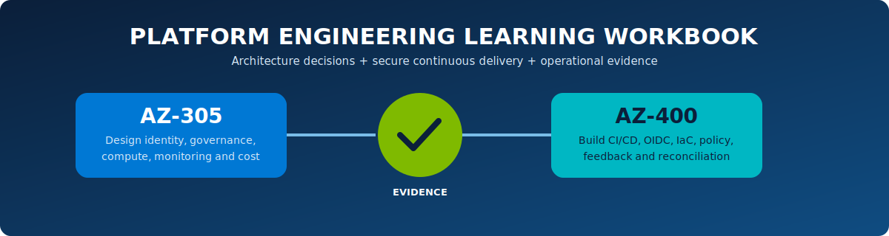

# Azure Platform Engineering Lab workbook

  

Use this workbook as a portfolio evidence checklist. Replace each blank with your own sanitized result or link.

## Learner record

| Field | Entry |
| --- | --- |
| Name/alias | |
| Date range | |
| Source commit | |
| Terraform/provider baseline | |
| Azure subscription alias | |
| GitHub owner alias | |
| Cost review date | |

## Module 1 — Platform product brief

- [ ] Write a one-paragraph target user/problem/outcome statement.
- [ ] Define the three golden paths and why AKS needs approval.
- [ ] List v1 boundaries and three production gaps.
- [ ] Choose adoption, lead-time, reliability and cleanup metrics.

Evidence link/notes:

## Module 2 — Architecture and trust

- [ ] Draw experience/control/workload planes.
- [ ] Mark shared versus disposable ownership.
- [ ] Diagram GitHub OIDC and GitHub App token flows.
- [ ] Explain Terraform state versus lifecycle inventory.
- [ ] Explain concurrency, Blob lease, ETag and fencing generation.

Evidence link/notes:

## Module 3 — Bootstrap and governance

- [ ] Validate state versioning, soft delete and Azure AD auth.
- [ ] Review platform OIDC exact subject and role scope.
- [ ] Inspect required tags, region/public HTTPS policy and exceptions.
- [ ] Compare budgets with TTL enforcement.
- [ ] Record a recent reconciler heartbeat.

Evidence link/notes:

## Module 4 — Web App vertical slice

| Evidence | Result/link |
| --- | --- |
| Valid request and UUIDv7 inventory-first checkpoint | |
| Generated repository numeric/node IDs | |
| Exact `deployment` OIDC subject and role scope | |
| Saved Terraform plan/policy result | |
| HTTPS `/healthz`, `/readyz`, `/metadata` | |
| Application Insights/diagnostics | |
| Tags, budget and policy assignment | |
| Azure-absence checks before repository deletion | |
| Final tombstone | |

## Module 5 — Container App isolation

- [ ] Capture immutable image tag/digest.
- [ ] Capture writer/runtime reader ABAC conditions.
- [ ] Prove cross-repository access is denied.
- [ ] Observe revision readiness and scale-to-zero.
- [ ] Prove ACR path is removed during cleanup.

Evidence link/notes:

## Module 6 — AKS approval and operations

- [ ] Prove a missing acknowledgement fails before Azure creation.
- [ ] Capture protected-environment reviewer approval.
- [ ] Capture quota/default-domain preflight.
- [ ] Verify RBAC/local-account/network/policy/OIDC/workload identity/monitoring configuration.
- [ ] Capture Helm/probes/trusted HTTPS.
- [ ] Record node resource group and prove its absence after cleanup.

Evidence link/notes:

## Module 7 — CI/CD and policy

- [ ] Map each PR gate to a prevented defect.
- [ ] Prove PR source validation has no Azure/GitHub App credential exchange.
- [ ] Render/test all scaffold overlays.
- [ ] Interpret one policy rejection and correct the source.
- [ ] Explain pinned actions/providers/modules and v2 compatibility.

Evidence link/notes:

## Module 8 — Monitoring and incident response

- [ ] Query stuck phases/retries and heartbeat.
- [ ] Create an active/expiring environment view.
- [ ] Define alert thresholds/owners/runbooks.
- [ ] Inject one safe failure and observe reconciliation.
- [ ] Write a short sanitized incident review.

Evidence link/notes:

## Module 9 — Destructive-safety proof

Complete with timestamps:

| Checkpoint | Time/result |
| --- | --- |
| Repository quiesced | |
| OIDC/RBAC revoked | |
| Terraform state empty | |
| Tracked IDs absent — pass 1 / pass 2 | |
| RG and AKS node RG absent — pass 1 / pass 2 | |
| Resource Graph tag empty — pass 1 / pass 2 | |
| `AZURE_ABSENT` evidence hash | |
| GraphQL node/numeric ID/owner match | |
| GitHub DELETE issued | |
| `DELETED` tombstone | |

Reviewer conclusion: Did repository deletion occur only after proven Azure absence?

## Module 10 — Architecture review presentation

Prepare a 10-minute walkthrough:

1. user/problem and self-service request;
2. planes/trust/ownership;
3. why three compute paths;
4. OIDC and least privilege;
5. governance/cost/monitoring;
6. lifecycle failure handling;
7. destructive-safety evidence;
8. production roadmap.

## Final self-assessment

| Capability | Explain | Demonstrate | Troubleshoot | Design production change |
| --- | :---: | :---: | :---: | :---: |
| Golden-path product contract | [ ] | [ ] | [ ] | [ ] |
| Terraform/state/inventory | [ ] | [ ] | [ ] | [ ] |
| GitHub OIDC/RBAC | [ ] | [ ] | [ ] | [ ] |
| Policy/budgets | [ ] | [ ] | [ ] | [ ] |
| Web App/Container Apps/AKS choice | [ ] | [ ] | [ ] | [ ] |
| CI/CD and artifact delivery | [ ] | [ ] | [ ] | [ ] |
| Monitoring/reconciliation | [ ] | [ ] | [ ] | [ ] |
| Verified teardown | [ ] | [ ] | [ ] | [ ] |

## Cleanup sign-off

- [ ] No live/transitioning inventory rows remain.
- [ ] Resource Graph finds no disposable environment tags.
- [ ] No test workload/node resource group remains.
- [ ] No test ACR repository remains.
- [ ] No generated test repository remains.
- [ ] Sanitized evidence/tombstones remain as intended.
- [ ] Cost Management was reviewed after ingestion delay.
